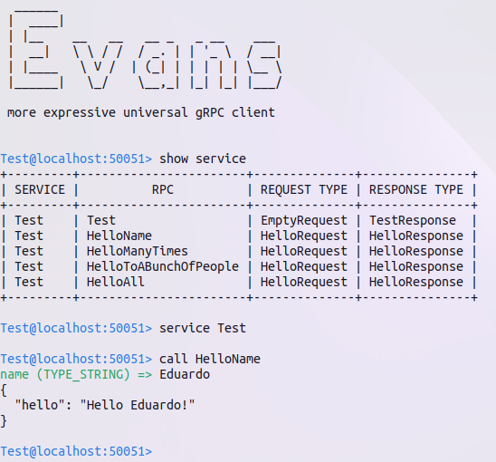

# test-python-grpc
Sample gRPC server and client applications written in Python

## Usage (e.g.):

Build the Docker image from Dockerfile: 

```bash
docker build . -t vasconcedu/test-python-grpc
```

Then run the container forwarding localhost port 50051 to container port 50051:

```bash
docker run -it -p 50051:50051 vasconcedu/test-python-grpc
```

gRPC service `Test` starts. Use a gRPC client such as `evans` to interact with it, e.g.:

```bash
evans --proto protos/test.proto --host localhost
```



Also, `test_client.py` is a sample gRPC client implementation.
